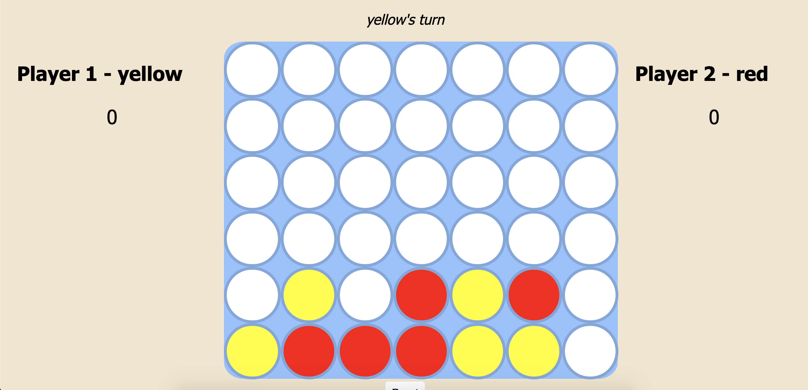
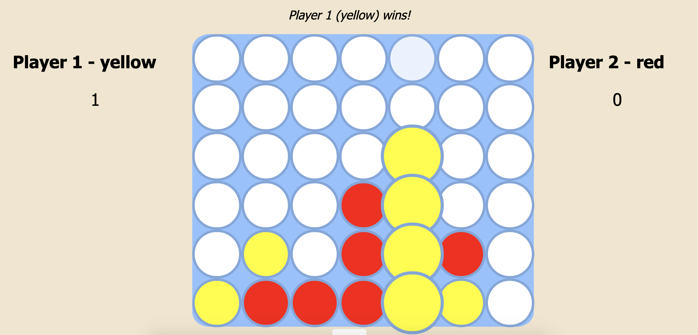

# Connect 4

## [Deployment Link](https://opconnect4.surge.sh)

**Known Bugs**
 
none

### About
My first project completed as part of the General Assembly SEI Remote course.

### Screenshots

Wireframe

Game Image 1

Game Image 2

### Technologies Used
* JavaScript
* HTML
* CSS

### Favorites
The animation that highlights the winning line of game pieces, and the minimal amount of hard coding that I did. The game board is generated at runtime, and the win logic uses an algorithm, O(n * n), as opposed to hard coding all win conditions.

### Growth
Creating this project helped to organize and refine everything that I learned in unit 1, JavaScript basics and essentials.

#### Icebox
- add the ability for the player to choose from a selection of colors
- add multiple board themes to choose from
- add a falling animation for the pieces when they are dropped
