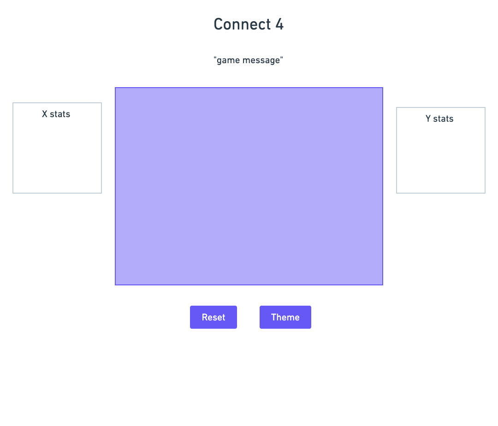

# connect-four

## TODO
- render and add score

## Wireframe

### Technologies Used
1. JavaScript
2. HTML
3. CSS

## Getting Started
[Play]()

### Next Steps
- add the ability for the player to choose from a selection of colors
- add multiple board themes to choose from
- add a falling animation for the pieces when they are dropped